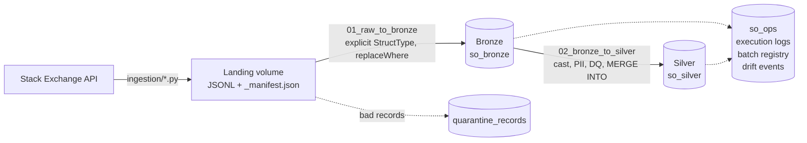

# Stack Overflow Developer Q&A Lakehouse

An end-to-end Medallion lakehouse on Databricks that tracks Stack Overflow questions and answers for 18 data-and-analytics technologies from 2018 onward. Phase 2 implements the **Bronze** and **Silver** layers in PySpark with explicit schemas, idempotent `MERGE INTO` upserts, parameterized backfills, schema-drift handling and audit logging.

| Phase | Deliverable |
|---|---|
| 1 | [Proposal](docs/phase1_proposal.md) ([PDF](docs/phase1_proposal.pdf)) |
| 2 | This README, the [`src/so_lakehouse`](src/so_lakehouse) package, the [notebooks](notebooks), the [data dictionary](docs/data_dictionary.md), the [Databricks run results](docs/databricks_run/README.md) and the [Phase 2 learning guide](docs/phase2_guide.md) ([PDF](docs/phase2_guide.pdf)) |

**Team:** Muhammad Sufyan (24L-2601), Muaaz Fahad (24L-2563). **Source:** [Stack Exchange API v2.3](https://api.stackexchange.com/docs), content licensed CC BY-SA 4.0.

---

## Architecture



| Layer | Unity Catalog schema | What it holds |
|---|---|---|
| Landing | `so_raw.landing` (volume) | One folder per batch: `full/<batch_id>/` or `incremental/<batch_id>/` |
| Bronze | `so_bronze` | Raw records typed by the contract, one row per record per batch, plus ingestion metadata |
| Silver | `so_silver` | One current, cleansed, PII-safe row per entity, kept up to date with `MERGE INTO` |
| Ops | `so_ops` | `pipeline_execution_logs`, `batch_registry`, `schema_drift_events` |

## Repository layout

| Path | Purpose |
|---|---|
| `src/so_lakehouse/schemas.py` | Every schema as `StructType`/`StructField` with comments and primary keys |
| `src/so_lakehouse/bronze.py` | Raw-to-Bronze: strict parse, quarantine, drift handling, `replaceWhere` writes |
| `src/so_lakehouse/silver.py` | Bronze-to-Silver: casting, de-duplication, PII, data quality, `MERGE INTO` |
| `src/so_lakehouse/audit.py` | Audit logger writing one log row per file or table processed |
| `src/so_lakehouse/batches.py` | Batch discovery and selection by id, date range or folder |
| `src/so_lakehouse/drift.py` | Contract checker that detects new columns, type changes and malformed JSON |
| `src/so_lakehouse/ddl.py` | Creates schemas, the volume and all tables |
| `notebooks/` | Databricks notebooks `00`–`04` and `99` (thin wrappers with widgets) |
| `jobs/so_lakehouse_pipeline.job.json` | Two-task Databricks job with parameters |
| `ingestion/` | API extraction scripts that write landing batches |
| `data/demo_landing/` | Five real batches (2 full, 3 incremental) used for the demo and tests |
| `tests/test_pipeline.py` | End-to-end tests of every Phase 2 requirement on local Spark + Delta |

---

## Databricks setup

1. **Create a workspace.** Sign up for Databricks Free Edition. Its default catalog is `workspace`.
2. **Clone the repo.** In the workspace, choose **Workspace → Create → Git folder** and paste the GitHub URL. A private repository needs a GitHub token under **Settings → Linked accounts**.
3. **Create the PII salt secret.** User ids are hashed with a secret salt. Create it once with the Databricks CLI:
   ```bash
   databricks secrets create-scope so_lakehouse
   databricks secrets put-secret so_lakehouse pii_salt --string-value "<long random string>"
   ```
   Keep the salt forever: changing it changes every user key. For a quick classroom demo you can instead type a value into the `pii_salt` widget of notebook 02.
4. **Run `notebooks/00_setup`.** It creates the schemas, the landing volume and every table, and copies `data/demo_landing` into `/Volumes/workspace/so_raw/landing`.
5. **Run `01_raw_to_bronze`, then `02_bronze_to_silver`,** with default widgets. Open `03_audit_and_validation` to see the logs, registry, drift events and duplicate checks.
6. **Optional:** import `jobs/so_lakehouse_pipeline.job.json` as a job after replacing `<your-email>` in the notebook paths. It runs both layers in order with shared parameters.

### Getting new data into the volume

- **From the workspace:** run `notebooks/99_ingest_api_to_landing`. This needs outbound internet access.
- **From a laptop:** run the ingestion scripts with `--landing-root data/landing`, then upload the new batch folder to `/Volumes/workspace/so_raw/landing/<full|incremental>/` with **Catalog → Volumes → Upload** or the CLI:
  ```bash
  python ingestion/incremental_load.py --since 2026-10-07T00:00:00 --landing-root data/landing --no-state
  databricks fs cp -r data/landing/incremental/<batch_id> dbfs:/Volumes/workspace/so_raw/landing/incremental/<batch_id>
  ```

---

## Execution guide: incremental load vs backfill

Both notebooks, the job and the CLI take the same parameters.

| Parameter | Raw-to-Bronze | Bronze-to-Silver | Format |
|---|---|---|---|
| `mode` | `incremental` or `backfill` | `incremental` or `backfill` | |
| `load_type` | `all`, `full` or `incremental` | n/a | |
| `batch_ids` | batches to reload | batches to re-process | comma-separated folder names |
| `start_date`, `end_date` | extraction-date range | extraction-date range | `YYYY-MM-DD`, inclusive |
| `landing_path` | explicit batch folder(s) | n/a | full path, comma-separated |
| `drift_mode` | `evolve` or `rescue` | n/a | |

**A batch id is the landing folder name,** for example `full_2025-01-01_2025-04-01` or `incr_20261007T155914Z`. The **batch date** is the UTC date the batch was extracted, read from its `_manifest.json`.

### Standard incremental load (daily)

Leave every widget empty except `mode = incremental`.

- **Raw-to-Bronze** loads every landing batch that `so_ops.batch_registry` does not show as loaded. Batches already loaded are logged as `SKIPPED`.
- **Bronze-to-Silver** processes every batch whose Bronze load is newer than its last Silver run.

```bash
python -m so_lakehouse.cli all --mode incremental
```

### Backfill (any historical timeframe)

Set `mode = backfill` and choose the scope. The selected batches are processed again even if they were done before. That is safe: Bronze replaces the batch's own rows and Silver merges idempotently.

| Goal | Parameters |
|---|---|
| Reload one batch | `batch_ids = incr_20260925T155859Z` |
| Reload everything extracted in a date range | `start_date = 2026-09-25`, `end_date = 2026-09-30` |
| Only the full-load batches in a range | `load_type = full` plus dates |
| A folder outside the standard layout | `landing_path = /Volumes/workspace/so_raw/landing/incremental/incr_...` |

```bash
python -m so_lakehouse.cli raw-to-bronze    --mode backfill --start-date 2026-09-25 --end-date 2026-09-25
python -m so_lakehouse.cli bronze-to-silver --mode backfill --batch-ids full_2025-01-01_2025-04-01,incr_20260925T155859Z
```

**To backfill a period not yet extracted,** first pull it from the API with `ingestion/full_load.py --from YYYY-MM-DD --to YYYY-MM-DD --landing-root ...`, then run the pipeline in incremental mode. The new batch is picked up automatically.

In the Databricks job, the same choices are made by overriding job parameters with **Run now with different parameters**.

---

## How the Phase 2 requirements are met

| Requirement | Where |
|---|---|
| Strict schema-on-read, no inference | `schemas.py` contracts; Bronze parses with `from_json(value, StructType)` in PERMISSIVE mode |
| Data types and casting | `silver.py`: epoch to `TIMESTAMP`, explicit casts to the Silver contract in `conform()` |
| `load_timestamp` on every record | A column in every Bronze, Silver and Ops table |
| Idempotency with `MERGE INTO` | Every Silver table is upserted with `MERGE INTO`; updates only when a row is newer and different |
| Parameterized backfills | `mode`, `batch_ids`, `start_date`, `end_date`, `landing_path` in every entry point |
| Schema drift | New columns: `mergeSchema` evolution or `_rescued_data`. Type changes, malformed lines and missing keys go to quarantine. Logged in `so_ops.schema_drift_events` |
| Audit logging | `so_ops.pipeline_execution_logs`: layer, parameter, start and end times, status, rows read, inserted, updated, deleted and quarantined |

The pipeline was run end to end on Databricks Free Edition on 10 October 2026: nine notebook tasks, all SUCCESS. The [results and exported notebook outputs](docs/databricks_run/README.md) show the logs, the zero-change backfill, the drift handling and the duplicate checks. The [Phase 2 learning guide](docs/phase2_guide.md) explains each mechanism.

---

## Data model

<!-- DATA-DICTIONARY:START -->
### Bronze layer (`so_bronze`)

#### `bronze.questions`

Raw questions exactly as received, one row per question per batch. **Primary key:** `question_id, _batch_id`

| Column | Type | Key | Nullable | Description |
|---|---|---|---|---|
| `question_id` | `bigint` | PK | no | Question id (natural key) |
| `title` | `string` |  | yes | Title, HTML-entity encoded |
| `body` | `string` |  | yes | Body HTML (contains free text and possible PII) |
| `tags` | `array<string>` |  | yes | All tags on the question |
| `owner` | `struct` |  | yes | Author snapshot |
| `owner.account_id` | `bigint` |  | yes | Network-wide Stack Exchange account id (PII, pseudonymous) |
| `owner.user_id` | `bigint` |  | yes | Stack Overflow user id (PII, pseudonymous) |
| `owner.user_type` | `string` |  | yes | registered, unregistered, moderator, team_admin or does_not_exist |
| `owner.reputation` | `int` |  | yes | Reputation at extraction time |
| `owner.accept_rate` | `int` |  | yes | Percent of the user's questions with an accepted answer |
| `owner.display_name` | `string` |  | yes | Public display name (PII, direct identifier) |
| `owner.profile_image` | `string` |  | yes | Avatar URL, may point to a personal photo (PII) |
| `owner.link` | `string` |  | yes | Profile URL containing id and name (PII) |
| `is_answered` | `boolean` |  | yes | API flag: has an upvoted or accepted answer |
| `view_count` | `int` |  | yes | Lifetime views at extraction time |
| `answer_count` | `int` |  | yes | Number of answers at extraction time |
| `score` | `int` |  | yes | Upvotes minus downvotes at extraction time |
| `accepted_answer_id` | `bigint` |  | yes | Accepted answer id, if any |
| `creation_date` | `bigint` |  | yes | Creation time, epoch seconds |
| `last_activity_date` | `bigint` |  | yes | Last activity (edit, answer, closure), epoch seconds |
| `last_edit_date` | `bigint` |  | yes | Last edit, epoch seconds |
| `closed_date` | `bigint` |  | yes | Closure time, epoch seconds |
| `closed_reason` | `string` |  | yes | Closure reason text |
| `protected_date` | `bigint` |  | yes | Protection time, epoch seconds |
| `locked_date` | `bigint` |  | yes | Lock time, epoch seconds |
| `community_owned_date` | `bigint` |  | yes | Community wiki time, epoch seconds |
| `bounty_amount` | `int` |  | yes | Open bounty in reputation points |
| `bounty_closes_date` | `bigint` |  | yes | Bounty expiry, epoch seconds |
| `content_license` | `string` |  | yes | Content licence, e.g. CC BY-SA 4.0 |
| `link` | `string` |  | yes | Public question URL |
| `migrated_from` | `struct` |  | yes | Migration details, if migrated |
| `migrated_from.question_id` | `bigint` |  | yes | Question id on the site it was migrated from |
| `migrated_from.on_date` | `bigint` |  | yes | Migration time, epoch seconds |
| `migrated_from.other_site` | `string` |  | yes | Raw JSON of the source site description |
| `posted_by_collectives` | `string` |  | yes | Raw JSON array of collectives |
| `_batch_id` | `string` | PK | no | Landing folder name, e.g. incr_20261007T155914Z |
| `_load_type` | `string` |  | yes | full or incremental |
| `_batch_date` | `date` |  | yes | UTC date of extraction; used for date-range backfills |
| `_extracted_at` | `timestamp` |  | yes | When the batch was pulled from the API (from _manifest.json) |
| `_source_file` | `string` |  | yes | Full path of the raw file the record came from |
| `_record_hash` | `string` |  | yes | SHA-256 of the raw JSON line |
| `_rescued_data` | `string` |  | yes | JSON of fields not in the contract (schema drift), else null |
| `load_timestamp` | `timestamp` |  | yes | When this record was written to Bronze |

#### `bronze.answers`

Raw answers exactly as received, one row per answer per batch. **Primary key:** `answer_id, _batch_id`

| Column | Type | Key | Nullable | Description |
|---|---|---|---|---|
| `answer_id` | `bigint` | PK | no | Answer id (natural key) |
| `question_id` | `bigint` |  | yes | Parent question id |
| `body` | `string` |  | yes | Body HTML (contains free text and possible PII) |
| `owner` | `struct` |  | yes | Author snapshot |
| `owner.account_id` | `bigint` |  | yes | Network-wide Stack Exchange account id (PII, pseudonymous) |
| `owner.user_id` | `bigint` |  | yes | Stack Overflow user id (PII, pseudonymous) |
| `owner.user_type` | `string` |  | yes | registered, unregistered, moderator, team_admin or does_not_exist |
| `owner.reputation` | `int` |  | yes | Reputation at extraction time |
| `owner.accept_rate` | `int` |  | yes | Percent of the user's questions with an accepted answer |
| `owner.display_name` | `string` |  | yes | Public display name (PII, direct identifier) |
| `owner.profile_image` | `string` |  | yes | Avatar URL, may point to a personal photo (PII) |
| `owner.link` | `string` |  | yes | Profile URL containing id and name (PII) |
| `is_accepted` | `boolean` |  | yes | Whether this is the accepted answer |
| `score` | `int` |  | yes | Score at extraction time |
| `creation_date` | `bigint` |  | yes | Creation time, epoch seconds |
| `last_activity_date` | `bigint` |  | yes | Last activity, epoch seconds |
| `last_edit_date` | `bigint` |  | yes | Last edit, epoch seconds |
| `locked_date` | `bigint` |  | yes | Lock time, epoch seconds |
| `community_owned_date` | `bigint` |  | yes | Community wiki time, epoch seconds |
| `content_license` | `string` |  | yes | Content licence |
| `posted_by_collectives` | `string` |  | yes | Raw JSON array of collectives |
| `recommendations` | `string` |  | yes | Raw JSON array of collective recommendations |
| `_batch_id` | `string` | PK | no | Landing folder name, e.g. incr_20261007T155914Z |
| `_load_type` | `string` |  | yes | full or incremental |
| `_batch_date` | `date` |  | yes | UTC date of extraction; used for date-range backfills |
| `_extracted_at` | `timestamp` |  | yes | When the batch was pulled from the API (from _manifest.json) |
| `_source_file` | `string` |  | yes | Full path of the raw file the record came from |
| `_record_hash` | `string` |  | yes | SHA-256 of the raw JSON line |
| `_rescued_data` | `string` |  | yes | JSON of fields not in the contract (schema drift), else null |
| `load_timestamp` | `timestamp` |  | yes | When this record was written to Bronze |

#### `bronze.deleted_questions`

Deletion tombstones from reconciliation. **Primary key:** `question_id, _batch_id`

| Column | Type | Key | Nullable | Description |
|---|---|---|---|---|
| `question_id` | `bigint` | PK | no | Id that the API no longer returns |
| `is_deleted` | `boolean` |  | yes | Always true for a tombstone |
| `detected_at` | `bigint` |  | yes | When the reconciliation noticed the deletion, epoch seconds |
| `_batch_id` | `string` | PK | no | Landing folder name, e.g. incr_20261007T155914Z |
| `_load_type` | `string` |  | yes | full or incremental |
| `_batch_date` | `date` |  | yes | UTC date of extraction; used for date-range backfills |
| `_extracted_at` | `timestamp` |  | yes | When the batch was pulled from the API (from _manifest.json) |
| `_source_file` | `string` |  | yes | Full path of the raw file the record came from |
| `_record_hash` | `string` |  | yes | SHA-256 of the raw JSON line |
| `_rescued_data` | `string` |  | yes | JSON of fields not in the contract (schema drift), else null |
| `load_timestamp` | `timestamp` |  | yes | When this record was written to Bronze |

#### `bronze.question_snapshots`

Score and view snapshots from reconciliation. **Primary key:** `question_id, snapshot_at, _batch_id`

| Column | Type | Key | Nullable | Description |
|---|---|---|---|---|
| `question_id` | `bigint` | PK | no | Question id |
| `snapshot_at` | `bigint` | PK | no | Snapshot time, epoch seconds |
| `score` | `int` |  | yes | Score at snapshot time |
| `view_count` | `int` |  | yes | Views at snapshot time |
| `answer_count` | `int` |  | yes | Answers at snapshot time |
| `is_answered` | `boolean` |  | yes | API answered flag at snapshot time |
| `closed_date` | `bigint` |  | yes | Closure time if closed, epoch seconds |
| `_batch_id` | `string` | PK | no | Landing folder name, e.g. incr_20261007T155914Z |
| `_load_type` | `string` |  | yes | full or incremental |
| `_batch_date` | `date` |  | yes | UTC date of extraction; used for date-range backfills |
| `_extracted_at` | `timestamp` |  | yes | When the batch was pulled from the API (from _manifest.json) |
| `_source_file` | `string` |  | yes | Full path of the raw file the record came from |
| `_record_hash` | `string` |  | yes | SHA-256 of the raw JSON line |
| `_rescued_data` | `string` |  | yes | JSON of fields not in the contract (schema drift), else null |
| `load_timestamp` | `timestamp` |  | yes | When this record was written to Bronze |

#### `bronze.quarantine_records`

Raw records that broke the contract, kept for replay. **Primary key:** `quarantine_id`

| Column | Type | Key | Nullable | Description |
|---|---|---|---|---|
| `quarantine_id` | `string` | PK | no | SHA-256 of entity, batch, file and raw line |
| `entity` | `string` |  | yes | questions, answers, deleted_questions or question_snapshots |
| `_batch_id` | `string` |  | yes | Batch the record came from |
| `_source_file` | `string` |  | yes | Raw file path |
| `reason` | `string` |  | yes | malformed_json, type_mismatch or missing_primary_key |
| `error_detail` | `string` |  | yes | Which fields failed and why |
| `raw_record` | `string` |  | yes | The untouched raw line, for replay after a fix |
| `load_timestamp` | `timestamp` |  | yes | When the record was quarantined |

### Silver layer (`so_silver`)

#### `silver.questions`

Current cleansed version of each question. **Primary key:** `question_id`

| Column | Type | Key | Nullable | Description |
|---|---|---|---|---|
| `question_id` | `bigint` | PK | no | Question id |
| `title` | `string` |  | yes | Title with HTML entities decoded |
| `created_at` | `timestamp` |  | yes | Creation time, UTC |
| `last_activity_at` | `timestamp` |  | yes | Last activity time, UTC |
| `last_edit_at` | `timestamp` |  | yes | Last edit time, UTC |
| `closed_at` | `timestamp` |  | yes | Closure time, UTC |
| `closed_reason` | `string` |  | yes | Closure reason as published |
| `closed_reason_code` | `string` |  | yes | Normalised reason, e.g. needs_details_or_clarity |
| `is_closed` | `boolean` |  | yes | closed_at is not null |
| `score` | `int` |  | yes | Latest known score |
| `view_count` | `int` |  | yes | Latest known lifetime views |
| `answer_count` | `int` |  | yes | Latest known answer count |
| `is_answered_api` | `boolean` |  | yes | API flag: has an upvoted or accepted answer |
| `has_any_answer` | `boolean` |  | yes | answer_count > 0 |
| `accepted_answer_id` | `bigint` |  | yes | Accepted answer id |
| `has_accepted_answer` | `boolean` |  | yes | accepted_answer_id is not null |
| `bounty_amount` | `int` |  | yes | Open bounty, reputation points |
| `tags` | `array<string>` |  | yes | All tags |
| `tracked_tags` | `array<string>` |  | yes | Tags that are in the project's tracked list |
| `owner_user_key` | `string` |  | yes | Salted SHA-256 of owner user_id (pseudonymised) |
| `owner_user_type` | `string` |  | yes | Owner account type |
| `owner_reputation` | `int` |  | yes | Owner reputation at extraction |
| `body_length` | `int` |  | yes | Characters in body HTML |
| `code_block_count` | `int` |  | yes | Number of <pre> code blocks |
| `inline_code_count` | `int` |  | yes | Number of <code> elements |
| `link_count` | `int` |  | yes | Number of <a> links |
| `image_count` | `int` |  | yes | Number of  elements |
| `title_length` | `int` |  | yes | Characters in decoded title |
| `is_migrated` | `boolean` |  | yes | Question was migrated from another site |
| `content_license` | `string` |  | yes | Content licence |
| `question_url` | `string` |  | yes | Public question URL |
| `is_deleted` | `boolean` |  | yes | Deleted on Stack Overflow (soft delete) |
| `deleted_detected_at` | `timestamp` |  | yes | When the deletion was detected |
| `metrics_as_of` | `timestamp` |  | yes | Time the score/view/answer metrics were observed |
| `source_batch_id` | `string` |  | yes | Bronze batch that supplied the current version |
| `source_extracted_at` | `timestamp` |  | yes | Extraction time of the current version (version column) |
| `record_hash` | `string` |  | yes | SHA-256 of business columns; detects real changes |
| `first_loaded_at` | `timestamp` |  | yes | When the row was first inserted into Silver |
| `load_timestamp` | `timestamp` |  | yes | When the row was last inserted or updated in Silver |

#### `silver.question_tags`

Question-to-tag bridge, one row per pair. **Primary key:** `question_id, tag`

| Column | Type | Key | Nullable | Description |
|---|---|---|---|---|
| `question_id` | `bigint` | PK | no | Question id |
| `tag` | `string` | PK | no | Tag name |
| `is_tracked_tag` | `boolean` |  | yes | Tag is in the tracked list |
| `source_batch_id` | `string` |  | yes | Batch that supplied this tag set |
| `load_timestamp` | `timestamp` |  | yes | When the pair was inserted into Silver |

#### `silver.answers`

Current cleansed version of each answer. **Primary key:** `answer_id`

| Column | Type | Key | Nullable | Description |
|---|---|---|---|---|
| `answer_id` | `bigint` | PK | no | Answer id |
| `question_id` | `bigint` |  | yes | Parent question id |
| `created_at` | `timestamp` |  | yes | Creation time, UTC |
| `last_activity_at` | `timestamp` |  | yes | Last activity time, UTC |
| `last_edit_at` | `timestamp` |  | yes | Last edit time, UTC |
| `score` | `int` |  | yes | Latest known score |
| `is_accepted` | `boolean` |  | yes | Accepted answer flag |
| `owner_user_key` | `string` |  | yes | Salted SHA-256 of owner user_id |
| `owner_user_type` | `string` |  | yes | Owner account type |
| `owner_reputation` | `int` |  | yes | Owner reputation at extraction |
| `body_length` | `int` |  | yes | Characters in body HTML |
| `code_block_count` | `int` |  | yes | Number of <pre> code blocks |
| `inline_code_count` | `int` |  | yes | Number of <code> elements |
| `link_count` | `int` |  | yes | Number of <a> links |
| `image_count` | `int` |  | yes | Number of  elements |
| `content_license` | `string` |  | yes | Content licence |
| `is_deleted` | `boolean` |  | yes | Parent question deleted on Stack Overflow |
| `deleted_detected_at` | `timestamp` |  | yes | When the deletion was detected |
| `source_batch_id` | `string` |  | yes | Bronze batch of the current version |
| `source_extracted_at` | `timestamp` |  | yes | Extraction time of the current version |
| `record_hash` | `string` |  | yes | SHA-256 of business columns |
| `first_loaded_at` | `timestamp` |  | yes | When first inserted into Silver |
| `load_timestamp` | `timestamp` |  | yes | When last inserted or updated in Silver |

#### `silver.users`

Pseudonymous users built from post owners. **Primary key:** `user_key`

| Column | Type | Key | Nullable | Description |
|---|---|---|---|---|
| `user_key` | `string` | PK | no | Salted SHA-256 of user_id |
| `user_type` | `string` |  | yes | Latest account type |
| `reputation` | `int` |  | yes | Latest known reputation |
| `accept_rate` | `int` |  | yes | Latest known accept rate |
| `first_seen_at` | `timestamp` |  | yes | Earliest post time seen for this user |
| `last_seen_at` | `timestamp` |  | yes | Latest post time seen for this user |
| `source_extracted_at` | `timestamp` |  | yes | Extraction time of the latest profile values |
| `first_loaded_at` | `timestamp` |  | yes | When first inserted into Silver |
| `load_timestamp` | `timestamp` |  | yes | When last inserted or updated in Silver |

#### `silver.question_snapshots`

Metric history per question. **Primary key:** `question_id, snapshot_at`

| Column | Type | Key | Nullable | Description |
|---|---|---|---|---|
| `question_id` | `bigint` | PK | no | Question id |
| `snapshot_at` | `timestamp` | PK | no | Observation time, UTC |
| `snapshot_date` | `date` |  | yes | Observation date, UTC |
| `score` | `int` |  | yes | Score at snapshot |
| `view_count` | `int` |  | yes | Views at snapshot |
| `answer_count` | `int` |  | yes | Answers at snapshot |
| `is_answered_api` | `boolean` |  | yes | API answered flag at snapshot |
| `closed_at` | `timestamp` |  | yes | Closure time if closed |
| `source_batch_id` | `string` |  | yes | Batch the snapshot came from |
| `load_timestamp` | `timestamp` |  | yes | When inserted into Silver |

#### `silver.post_text_masked`

Restricted: masked titles and bodies for text analysis. **Primary key:** `post_type, post_id`

| Column | Type | Key | Nullable | Description |
|---|---|---|---|---|
| `post_type` | `string` | PK | no | question or answer |
| `post_id` | `bigint` | PK | no | question_id or answer_id |
| `title_masked` | `string` |  | yes | Decoded title with PII masked (questions only) |
| `body_masked` | `string` |  | yes | Body HTML with emails, IPs, secrets and connection strings masked |
| `masked_token_count` | `int` |  | yes | How many values were masked |
| `source_extracted_at` | `timestamp` |  | yes | Extraction time of the current version |
| `record_hash` | `string` |  | yes | SHA-256 of the masked text |
| `load_timestamp` | `timestamp` |  | yes | When last inserted or updated in Silver |

#### `silver.dq_quarantine`

Records that failed Silver data-quality rules. **Primary key:** `dq_id`

| Column | Type | Key | Nullable | Description |
|---|---|---|---|---|
| `dq_id` | `string` | PK | no | SHA-256 of entity, key, rule and batch |
| `entity` | `string` |  | yes | questions or answers |
| `record_key` | `string` |  | yes | Natural key of the failing record |
| `rule` | `string` |  | yes | Data-quality rule that failed |
| `source_batch_id` | `string` |  | yes | Batch of the failing record |
| `payload` | `string` |  | yes | JSON of the record as it would have entered Silver |
| `load_timestamp` | `timestamp` |  | yes | When the record was quarantined |

### Operational tables (`so_ops`)

#### `ops.pipeline_execution_logs`

One row per file or table processed by any run. **Primary key:** `log_id`

| Column | Type | Key | Nullable | Description |
|---|---|---|---|---|
| `log_id` | `string` | PK | no | Unique id of this log entry |
| `run_id` | `string` |  | yes | Id shared by all entries of one pipeline invocation |
| `pipeline_name` | `string` |  | yes | raw_to_bronze or bronze_to_silver |
| `layer` | `string` |  | yes | Raw-to-Bronze or Bronze-to-Silver |
| `run_mode` | `string` |  | yes | incremental or backfill |
| `load_type` | `string` |  | yes | full, incremental or mixed |
| `entity` | `string` |  | yes | Entity or step processed |
| `batch_id` | `string` |  | yes | Batch processed (Raw-to-Bronze) or null |
| `source_parameter` | `string` |  | yes | File path, batch list or date range processed |
| `target_table` | `string` |  | yes | Table written |
| `start_time` | `timestamp` |  | yes | Step start, UTC |
| `end_time` | `timestamp` |  | yes | Step end, UTC |
| `duration_seconds` | `double` |  | yes | end_time minus start_time |
| `status` | `string` |  | yes | SUCCESS, FAILED or SKIPPED |
| `rows_read` | `bigint` |  | yes | Records read from the source |
| `rows_inserted` | `bigint` |  | yes | Rows inserted into the target |
| `rows_updated` | `bigint` |  | yes | Rows updated in the target |
| `rows_deleted` | `bigint` |  | yes | Rows deleted or replaced in the target |
| `rows_quarantined` | `bigint` |  | yes | Records sent to quarantine |
| `message` | `string` |  | yes | Error message or note |
| `load_timestamp` | `timestamp` |  | yes | When this log entry was written |

#### `ops.batch_registry`

Control table: which batches are loaded into Bronze and Silver. **Primary key:** `batch_id`

| Column | Type | Key | Nullable | Description |
|---|---|---|---|---|
| `batch_id` | `string` | PK | no | Landing folder name |
| `load_type` | `string` |  | yes | full or incremental |
| `batch_date` | `date` |  | yes | UTC extraction date |
| `extracted_at` | `timestamp` |  | yes | Extraction time from the manifest |
| `landing_path` | `string` |  | yes | Folder the batch was read from |
| `manifest_json` | `string` |  | yes | Copy of _manifest.json |
| `bronze_status` | `string` |  | yes | Outcome of the last Raw-to-Bronze run |
| `bronze_loaded_at` | `timestamp` |  | yes | When Bronze last loaded this batch |
| `silver_status` | `string` |  | yes | Outcome of the last Bronze-to-Silver run |
| `silver_processed_at` | `timestamp` |  | yes | When Silver last processed this batch |
| `load_timestamp` | `timestamp` |  | yes | When this registry row was last written |

#### `ops.schema_drift_events`

Schema drift seen in raw files and the action taken. **Primary key:** `event_id`

| Column | Type | Key | Nullable | Description |
|---|---|---|---|---|
| `event_id` | `string` | PK | no | SHA-256 of batch, entity, drift type and column |
| `run_id` | `string` |  | yes | Pipeline run that saw the drift |
| `_batch_id` | `string` |  | yes | Batch containing the drift |
| `entity` | `string` |  | yes | Entity file |
| `drift_type` | `string` |  | yes | new_column, type_mismatch, malformed_json or missing_primary_key |
| `column_path` | `string` |  | yes | Affected column, dotted for nested fields |
| `record_count` | `bigint` |  | yes | Records affected in the batch |
| `example_value` | `string` |  | yes | One example value, truncated |
| `action_taken` | `string` |  | yes | evolved, rescued or quarantined |
| `load_timestamp` | `timestamp` |  | yes | When the event was recorded |

<!-- DATA-DICTIONARY:END -->

---

## Local development and tests

The same package runs on a laptop with open-source Spark and Delta Lake. You need Java 17, because Spark 3.5 does not run on Java 23 or newer.

```bash
python3 -m venv .venv && source .venv/bin/activate
pip install -r requirements-dev.txt
export JAVA_HOME=/path/to/jdk-17
export PYTHONPATH=src

pytest -q tests                                                         # every Phase 2 requirement, end to end
python -m so_lakehouse.cli setup --reset --landing-root data/demo_landing
python -m so_lakehouse.cli all --mode incremental --landing-root data/demo_landing
python scripts/generate_data_dictionary.py                              # refresh the data model in this README
```

Local tables live in `.local/`, which is git-ignored. When a batch is reloaded locally, the Hive metastore may print `ERROR HiveAlterHandler: Failed to alter table`. That message is harmless: Delta keeps the real schema in its own transaction log, and Databricks Unity Catalog does not use this component.
